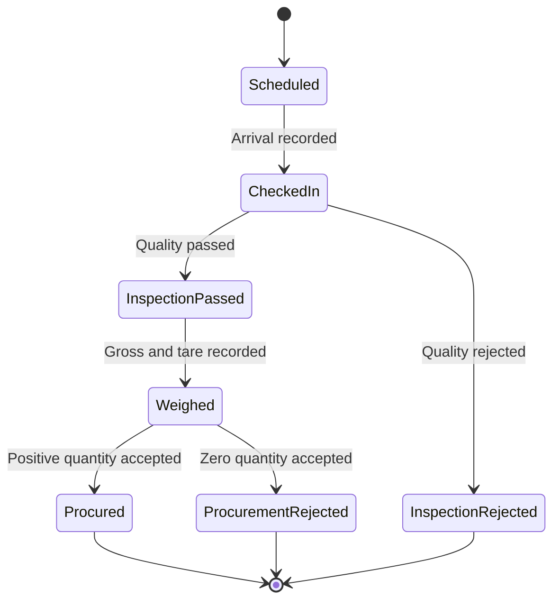

# Milestone 4 explained

Milestone 4 turns an approved DAPP arrival token into a controlled physical procurement record. It preserves the most important domain boundary:

```text
request / reservation / token != procurement transaction != payment
```

A farmer's intent, reserved centre capacity, and physical arrival do not count as procurement. DAPP creates a transaction only when an officer records a passed inspection, a valid net weighment, and a positive accepted quantity. The resulting amount is payable; Milestone 4 does not mark it paid.

## 1. Lifecycle



The appointment remains `CHECKED_IN` while inspection, weighment, and acceptance are in progress. It ends as `COMPLETED` for a positive procurement or `REJECTED` for either quality rejection or zero accepted quantity.

## 2. Physical records

Milestone 4 adds six explicit records:

| Record | Meaning | Cardinality |
| --- | --- | --- |
| `ArrivalCheckIn` | Token presented and produce physically arrived | One per appointment/request |
| `QualityInspection` | Quality result, grade, measurements, and reason | One per check-in |
| `Weighment` | Gross, tare, server-derived net, bag count, reference | One per inspection |
| `AcceptanceDecision` | Accepted/rejected split and reason | One per weighment |
| `ProcurementTransaction` | Positive accepted quantity, rate, and payable total | At most one per request/appointment/decision |
| `ProcurementReceipt` | Human-facing receipt number and verification code | One per transaction |

All foreign keys in the physical chain use `PROTECT` where deletion could break the audit trail. The API exposes the chain as read-only data; stages can be created only through named workflow actions. Django admin also makes these records read-only and unavailable for deletion.

## 3. Atomic transaction boundary

The final acceptance operation runs in one database transaction and locks records in a consistent order:

1. procurement request;
2. procurement centre;
3. farmer crop;
4. appointment; and
5. capacity reservation.

For a positive accepted quantity, one commit performs all of the following:

- creates the acceptance decision;
- creates the procurement transaction;
- creates its receipt;
- changes the reservation from `ACTIVE` to `CONSUMED`;
- subtracts accepted quantity from the farmer crop;
- completes the appointment;
- marks the request `PROCURED`; and
- appends the request status event.

If any validation or database operation fails, none of those writes survive.

A zero accepted quantity follows a separate safe branch: the decision is recorded, the active reservation is released, and the request/appointment are rejected. No transaction or receipt is created and crop availability does not change.

## 4. Quantity invariants

The accepted quantity must satisfy every bound below:

```text
0 <= accepted quantity <= net weight
accepted quantity <= reserved quantity
accepted quantity <= current farmer-crop availability
accepted quantity + rejected quantity = net weight
```

Gross weight must exceed tare weight. Net weight is calculated on the server as `gross - tare`; clients cannot supply it. A positive accepted quantity requires a positive rate. DAPP calculates the payable total as `accepted quantity × rate`, rounded to two decimal places using half-up rounding.

Full acceptance needs no reason. Partial or full rejection always needs a reason.

## 5. Capacity semantics

An active reservation protects an upcoming or in-progress arrival. Successful procurement changes it to `CONSUMED`; rejection or cancellation changes it to `RELEASED`.

Centre capacity for a date counts both active and consumed allocations:

```text
allocated = active reserved + consumed reserved
available = daily capacity - allocated
```

Consumed allocation continues to count for the original date, preventing later approvals from silently overbooking capacity already used that day. Farmer-crop reservation checks count only active reservations because accepted crop is deducted when a reservation is consumed.

## 6. Role boundaries

| Operation | Farmer | Procurement officer | Administrator |
| --- | --- | --- | --- |
| View appointment and physical progress | Own only | Active assigned centre | All |
| Record physical stage | No | Active assigned centre | All active centres |
| View transaction | Own only | Active assigned centre | All |
| Download receipt | Own only | Active assigned centre | All |

An officer outside the active centre assignment cannot discover or mutate the appointment or transaction. A farmer cannot post any physical-processing action.

## 7. API actions

All paths are below `/api/v1` and use the existing HTTP-only JWT cookie plus CSRF protection for unsafe methods.

| Method | Path | Body summary |
| --- | --- | --- |
| `POST` | `/appointments/{id}/check-in/` | transport mode, vehicle number, notes |
| `POST` | `/appointments/{id}/inspect/` | passed/rejected, grade, measurements, reason |
| `POST` | `/appointments/{id}/weigh/` | gross, tare, bag count, weighbridge reference |
| `POST` | `/appointments/{id}/decide/` | accepted quantity, rate, reason |
| `GET` | `/appointments/?operational=true` | scheduled or checked-in work queue |
| `GET` | `/procurement-transactions/` | role-scoped immutable history |
| `GET` | `/procurement-transactions/{id}/receipt/` | downloadable PDF receipt |

Each successful action returns the refreshed appointment with a `processing` projection and a `next_action` value. The client uses `CHECK_IN`, `INSPECT`, `WEIGH`, `DECIDE`, `WAITING`, or `COMPLETE` instead of guessing the next legal transition.

## 8. Receipt boundary

The generated PDF includes:

- receipt, transaction, request, token, and verification identifiers;
- farmer, crop, and procurement centre;
- net, accepted, and rejected quantities;
- rate and amount payable;
- pending payment status; and
- recorded date and decision notes.

The PDF explicitly states that it confirms physical procurement and is not proof of payment. Payment and settlement must be represented by a separate Milestone 5 record.

## 9. Dashboard behavior

The procurement officer and administrator workspaces expose a physical procurement desk. Each open arrival card shows the recorded stages and only its next legal action. Future-dated tokens remain visible but cannot be checked in early.

Farmers see their token progress and a procurement history. All roles can download receipts only within their queryset scope. Summary quantities and payable amounts aggregate `ProcurementTransaction`; requests and reservations never inflate procurement totals.

## 10. Verification coverage

Backend tests cover:

- rejection of early check-in;
- farmer and cross-centre officer isolation;
- administrator processing authority;
- partial acceptance and exact payable amount;
- reservation consumption and crop deduction;
- quality rejection without crop mutation;
- invalid weighment rollback and retry;
- full rejection without a transaction;
- net/reservation bounds and duplicate prevention;
- transaction history visibility and unavailable deletion;
- PDF receipt generation; and
- actual-transaction dashboard totals.

Frontend verification covers TypeScript API contracts, production build, lint, role navigation, connected panel loading states, currency/quantity formatting, and server-rendered entry points.

## 11. Safe Milestone 5 extension (implemented)

Payments should reference an existing `ProcurementTransaction` and use their own immutable status/event history. A safe design should make initiation idempotent, record gateway/bank references without exposing credentials, reconcile settlement asynchronously, and issue proof of payment only after a verified settled state.

Milestone 5 now implements this extension. Notifications, grievances, and analytics reference the existing request, appointment, transaction, and payment identifiers without changing Milestone 4's physical audit trail. See `MILESTONE_5_EXPLAINED.md` for the completed operational design.

## 12. Suggested reading order

1. `backend/apps/procurement/models.py` — physical records and database constraints.
2. `backend/apps/procurement/intake_services.py` — locked, atomic transitions.
3. `backend/apps/procurement/intake_serializers.py` — input and read projections.
4. `backend/apps/procurement/views.py` — role-scoped actions and history.
5. `backend/apps/procurement/receipts.py` — PDF receipt generation.
6. `backend/apps/procurement/tests/test_physical_procurement_api.py` — invariant coverage.
7. `app/dashboard/panels/procurement-desk-panel.tsx` — officer/admin operations.
8. `app/dashboard/panels/transactions-panel.tsx` — history and receipt download.
